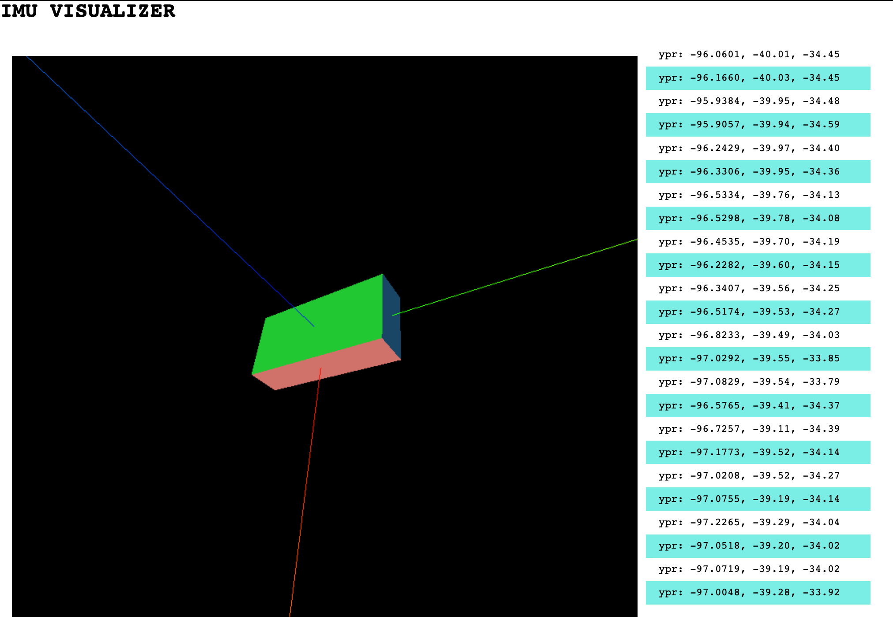

# IMU Attitude Estimation and Visualization

Short two sentence description of the project



## Quickstart

1. Load and run the Arduino code on a board with the MPU9250 sensor connected as per the pinout described in `mpu9250/mpu9250.ino`
2. Start the frontend app, accessible in the browser at `http://localhost:8082`
```
cd app
npm start
```
3. Run the estimator backend, which reads in raw sensor data over serial and runs various attitude estimators, forwarding those results to the app in real time.
```
cd estimation
cargo run --bin imu-filters
```

If you wish to run the estimator and visualization without the IMU or breakout board hardware, you may do so by playing back a saved data file. Skip step 1 above, and provide the relevant CLI flags in step 3 as follows:
```
cd estimation
cargo run --bin imu-filters -- -f data/raw_imu_data.csv
```

## Background
Why I decided to do this project

What I learned

## Organization
- Three separate modules & languages
- Devenv / nix

A simple project to visualize absolute orientation (AHRS) using an MPU-9250 IMU + Magnetometer sensor and an on-device implementation of the Madgwick filter on an Arduino Uno board. Visualization is done in the browser using Three.js after reading serial data from the Arduino and passing via websocket.

### References: 

- [Kris Winer's comprehensive MPU 9250 reference and Arduino code](https://github.com/kriswiner/MPU9250)
- [MPU9250 Datasheet](https://invensense.tdk.com/wp-content/uploads/2015/02/PS-MPU-9250A-01-v1.1.pdf)
- [invensense-imu repo](https://github.com/bolderflight/invensense-imu)
- [AHRS Python library and excellent docs and derivations](https://ahrs.readthedocs.io/en/latest/index.html)
- [Clear and approachable Kalman filter explainer](https://www.bzarg.com/p/how-a-kalman-filter-works-in-pictures/)
- [Madgwick Filter PhD Thesis](https://x-io.co.uk/downloads/madgwick-phd-thesis.pdf)

