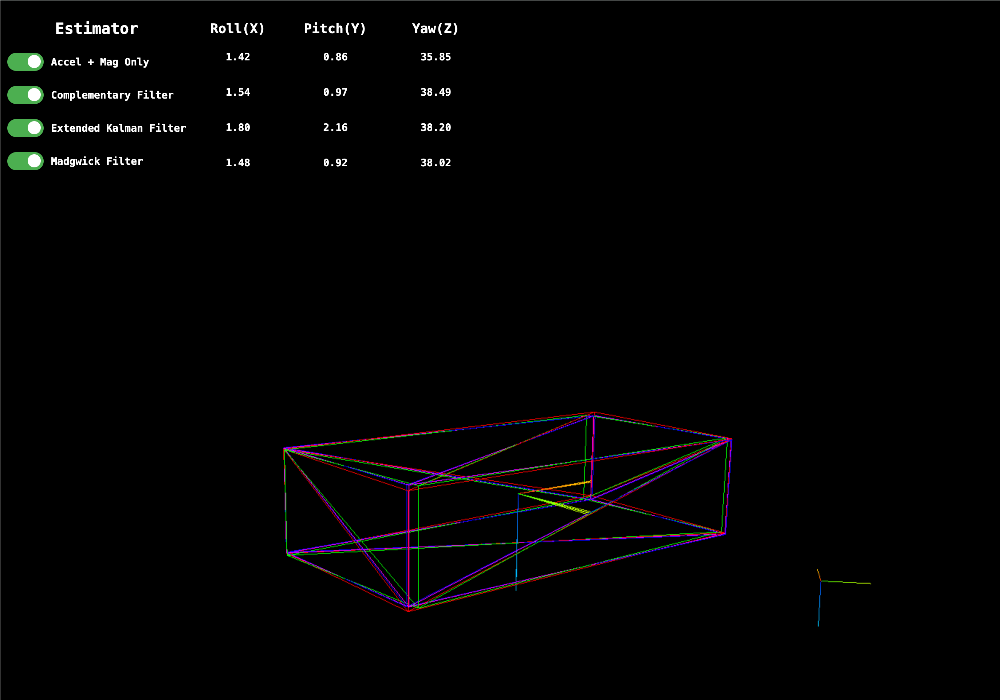

# IMU Attitude Estimation and Visualization

Implementation and visualization of various fused sensor AHRS / orientation estimators for a 9-axis IMU (MPU9250):
- Direct estimation from accelerometer & magenetometer readings
- Complementary filter
- Extended Kalman filter
- Madgwick filter

This is a toy project where estimation / filtering is done at lower rate (~200Hz) on a laptop rather than on the microcontroller connected directly to the IMU, which facilitated ease of debugging and introspection, comparisons of multiple estimators, and visualization.



## Quickstart

1. Load and run the Arduino code on a board with the MPU9250 sensor connected as per the pinout described in `mpu9250/mpu9250.ino`
2. Start the frontend app, accessible in the browser at `http://localhost:8082`
```
cd app
npm start
```
3. Run the estimator backend, which reads in raw sensor data over serial and runs various attitude estimators, forwarding those results to the app in real time.
```
cd estimation
cargo run
```

If you wish to run the estimator and visualization without the IMU or breakout board hardware, you may do so by playing back a saved data file. Skip step 1 above, and provide the relevant CLI flags in step 3 as follows:
```
cd estimation
cargo run -- -f data/raw_imu_data.csv
```

## Background
I decided to do this quick project with the original goal of building better intuition for the inner-workings of the quaternion EKF. I found the exercise of working through the mathematical derivations ([AHRS EKF docs](https://ahrs.readthedocs.io/en/latest/filters/ekf.html)) to be worthwhile, and after implementing with a real (noisy) sensor, the effects of tuning noise covariances became much more clear.

Comparison of the EKF estimate and its covariances with the results of the AM-only and complementary filters was particularly illuminating. With the MPU9250, the magnetometer noise was especially dominant, even after calibrations, and the longer horizon drift incurred here is clear when its noise is filtered out. 

The Madgwick filter was also quite interesting to implement. Its (qualitative) performance is very similar to that of the EKF, and although it does not produce or minimize a covariance estimate, it has optimal-seeking behavior for the more narrowly-defined objective of minimizing angular distance between the measured and expected gravity and magnetic field vectors. This is done by taking a single gradient descent step on each iteration of the filter, leading to a simple and efficient implementation suitable for high sample rates.

## Organization
This project is split between three separate modules:
1. `mpu9250`: Arduino code (Arduino Uno R3) to process raw sensor data from a connected MPU9250 and forward accelerometer, magnetometer, and gyroscope measurements via serial connection to a separate computer.
2. `estimation`: Rust library that implements the orientation estimation and filtering algorithms. Reads input data either from serial or a file, and sends out via websocket. See `cargo run --bin estimation --help` for more details
3. `app`: Basic frontend using Node / Typescript and Three.js to render 3D visualizations of the IMU's orientation estimates


This project uses Nix (via [devenv](https://devenv.sh/)) as a convenience for creating a devshell with all necessary dependencies. However, the project is not currently built using nix, and nix is not required to run. In this case, just make sure that the Arduino, Rust, and Node dependencies are all installed locally.

### References: 

- [Kris Winer's comprehensive MPU 9250 reference and Arduino code](https://github.com/kriswiner/MPU9250)
- [MPU9250 Datasheet](https://invensense.tdk.com/wp-content/uploads/2015/02/PS-MPU-9250A-01-v1.1.pdf)
- [invensense-imu repo](https://github.com/bolderflight/invensense-imu)
- [AHRS Python library and excellent docs and derivations](https://ahrs.readthedocs.io/en/latest/index.html)
- [Clear and approachable Kalman filter explainer](https://www.bzarg.com/p/how-a-kalman-filter-works-in-pictures/)
- [Madgwick Filter PhD Thesis](https://x-io.co.uk/downloads/madgwick-phd-thesis.pdf)

